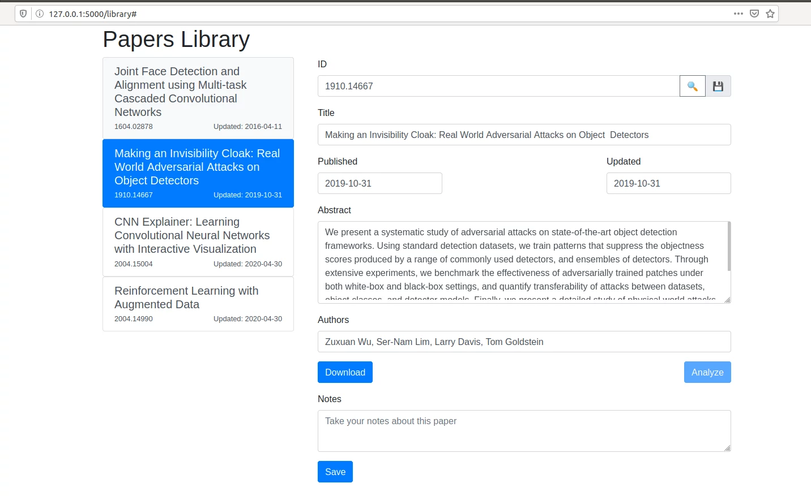

# Papers Library (WIP) #

Get the paper information from Arxiv based on the ID using the Arxiv API.

## TODO: ##

* Download the PDF
* Analyze the text and extract other sections in addition to the abstract
* Save form data into a database